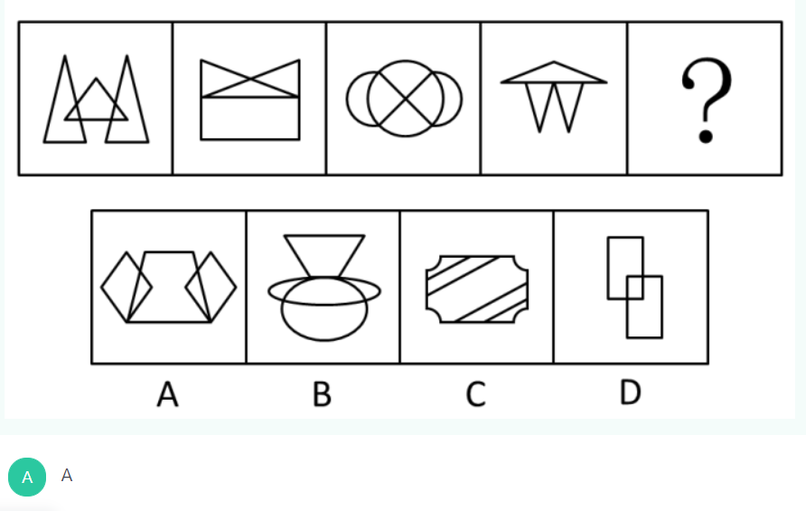
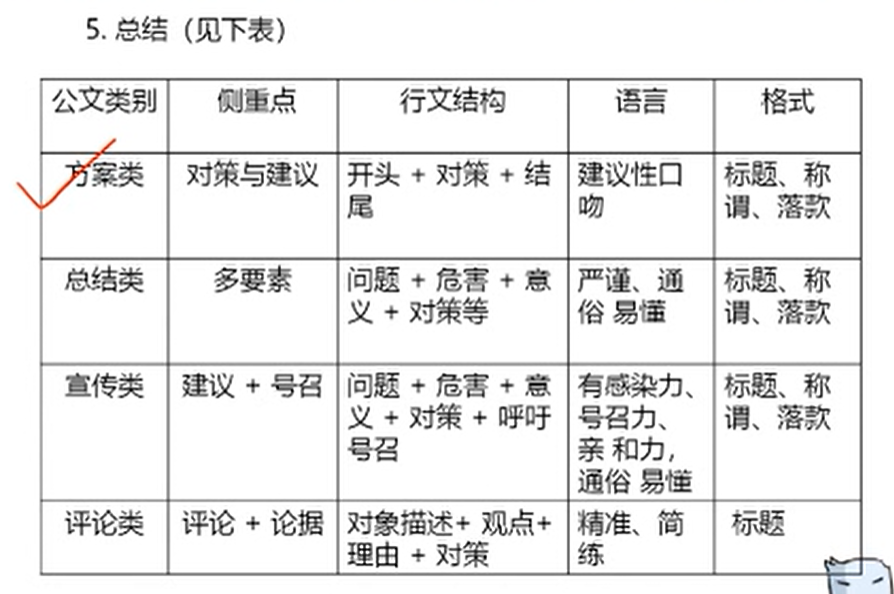

# 2020年公务员考试：行政能力测试

---
## 1、言语理解与表达（1周）
---
### 1.1 中心理解题
中心理解是基础，提问选项三步走， 
**词**和**脉络**都是宝，缺一不可少不了。
一字一句不可取，详略结合是王道，
背景例子不重要，略读略读放心上。
**主题对策**留心眼，使坏给你挖坑跳，
火眼金睛要识别，套路满满全知道。

**学习重点内容**
- 转折、因果关联词及重点位置
- 主题词的特征
- 中心理解题错误选项的特征
- 中心理解题略读句子特征

**解题顺序**：先看提问，在阅读文段

**提问方式**：
1. 这段文字主要/旨在/重在/意在/想要说明（论述/强调）的是…
2. 这段文字的主旨/主题/观点是…
3. 对这段文字概括最恰当的是…
   

**解题思路**：寻找中心句
- 有中心句-同义替换（很少有和文段一模一样的）
- 无中心句-全面概括

1. 重点词语：关联词、主题词、程度词
2. 行文脉络：文段的写作思路或者文章的结构
   
#### 1.1.1 转折关系
**重点词语之关联词**
**典型标志词：**
虽然…但是…；尽管…可是…；…不过…；…然而…；…却…；其实/事实上/实际上…
**非典型标志词：**
殊不知、截然不同、截然相反、全新的研究、一种误读、相对而言
**理论要点**：**转折之后是重点**
**选项中出现A语B的差别/区别/差异/不同，文段应为A与B的并列结构**
**逆向思维：**
理论依据：转折前后句子意思相反
使用文段特征：（很多人认为、大多数人认为、不少人认为、传统观点认为）+ 转折表述
转折关系常见错误选项特征：转折前的表述  

**错误选项特征：** 转折前的内容，例子、原因、背景…，无中生有，绝对表述，与文意相悖

**略读句子特征：** 
**例子**：比如、例如、诸如、譬如等；
**原因**：因为、由于、：、—— 等；
**背景**：近年来、随着、在…背景下等

#### 1.1.2 重点词语之主题词
**特征：**
   1. 文段围绕其展开
   2. 一般高频出现
   3. 多为名词
   4. 前有引入或后有解释说明
   5. 
**理论要点：** 正确选项中需包含文段主题词
**干扰选项：** 范围扩大/缩小/偷换

#### 1.1.3 因果关系
**典型格式：** 因为……所以……；由于……因此……；
**理论要点：** 结论是重点
**引导结论的标志词：**
1. 所以、因此、因而、故而、于是、可见、看来、为什么、为何；
2. 导致、致使、使得、造成；
   
结论词出现的尾句，大部分情况下是对前文的总结，其之后是文段的中心

结论句出现在文段开头/中间，之后仍有其他语句:
1. 之后的句子是进一步解释说明，此时中心句仍为结论句；
2. 之后又出现并列、因果、转折，需要结合多种关联词共同分析。

**巧用读题技巧：**
1. 详略度（背景、例子要略读）：
   近年来、传统、以往、随着、……
   如、比如、……
2. 概括文意
   危害、导致、疾病、阻碍、滞后、…… 【不好】
   有助于、推动、促进、提高、…… 【好】
3. 缩略版

#### 1.1.4 必要条件关系

**典型格式**：只有……才……
**理论要点**：必要条件是重点，即“只有”和“才”之间的部分

**对策标志词**：
1. 应该、应当、必须、需要、亟需，亟待+做法
2. 通过/采取……手段/途径/措施/方式/方法/渠道，才能……
3. 呼吁、倡导、提倡、提醒、建议+做法
4. 前提、基础、保障

**【对策行文脉络】**
1. 提出问题--分析问题--**解决问题**
2. 提出问题--**解决问题**--解释说明（意义效果）
3. **对策**+正反论证/原因论证

**重点词语之 程度词**
**标志词：** 更、尤其、正是、特别是、真正、根本、最（核心、突出）等
**理论要点** 程度词所在的语句通常为重点

#### 1.1.5 并列关系
**理论要点：** 概括要全面完整
**文段特征：** 
1. 包含并列关联词，如此外、另外、同时、以及、“；”
2. 层次分明，格式工整
3. 无明显其他关联词语

**选项特征：**
1. 两方面情况：和、及、与、同
2. 更多种情况：许多、一些、不同、各种、一系列

分句表达意思相同--提取共性
【补充思维】：
首先保证分句谈论主题词正确，然后在概括内容上的共性。
表述片面的选项需排除

**【文段设置】**：围绕同一话题，时间顺序引导并列
**【选项设置】**：表述片面、主题词错误

#### 1.1.6 行文脉络
1. 总--分：观点+解释说明，中心句后为不同类型的解释说明
2. 分--总：（1）结论、对策（2）代词（这、此）引导的尾句需关注，常考标志词（对此/有鉴于此/尽管如此/在这个意义上/从这个角度老说等）。【典型标志】：文段最后出现“换言之”、“简而言之”、“换句话说”等标志词，【解题要点】：标志词之后是对前文的总结概括。
3. 总--分--总
4. 分--总--分
5. 分--分
   
**【理论要点】：** 把握中心句及分述句的特点
**【中心句特征】：** 观点（对策、结论、评价）
**【分述句特征】：**
1. 举例子：比如、例如、……就是例证 等
2. 调查报告、数据资料等
3. 正反例证
4. 原因解释
5. 并列分述
   
### 1.2 细节判断题
【**提问方式**】：
1. 以下对文段理解正确/不正确的是……
2. 符合/不符合这段话意思的是……
3. 从文段中可以得知/推出的是……

一、典型细节题

【**错误选项类型**】：
1. 无中生有：文段中没有提及
2. 偷换概念（替换、混搭）：
3. 偷换时态：将来时（将要、立刻、趋势、以后），完成时（已、已经、了、完成），进行时（正在、在……中，着）
4. 偷换语气
5. 无关对比项：A优于/大于/小于/超过B、A比B更……
6. 文意相悖：与文段意思或者逻辑相反的
7. 并列偷换：文段：A同时B，选项：以A为主、以B为主
   
**重点**看选项中的专有名词，物名、人名、地名、数量   
**优先**看有对比的选项。

二、细节主旨化

【**理论要点**：】优选契合主旨的选项

### 1.3 语句表达
#### 1.3.1 语句排序题
【**理论要点**】：三步走战略
1. 根据选项提示，一定要对比确定首句
   （1）**下定义**：……就是/是指……
   （2）**背景引入**：随着、近来、在……大背景/环境下
   （3）**非首句特征**。1）关联词的后半部分；2）指代词：（一句话中出现指代词，但是并未出现指代对象，则该局不能作为首句）人称代词（他/她/它），指示代词（这/那）
2. 同时进行，结合题目特点灵活运用
   （1）**确定捆绑集团**---紧紧绑在一起。（1）指代词捆绑：这/那/他/该/其；（2）关联词，配套出现（不但……而且……），单独一个（但、同时、分析句子的意思）
   （2）**确定顺序**。1）时间顺序：年份、朝代、时间提示词（过去、现在、将来）2）逻辑顺序，① 行文脉络，观点+解释说明；② A和B，先说A后说B
   （3）**确定尾句**（对比确定）：结论、对策，
3. 验证（只验证基本锁定的答案。而非全部验证）

#### 1.3.2 语句填空题
【**理论要点**】：
1. 横线在结尾: 1）总结前文；2）提出对策
2. 横线在开头：需概括文段的中心内容
3. 横线在中间：1）注意与上下文联系；2）把握好主题词，保证文段话题一致
   
#### 1.3.3 接语选择题

【理论要点】：
①仅有一个选项与尾句话题一致--直接选
②选不出来的时候--结合前文
【干扰项特征】：文段中已经论证过的内容
理解要紧紧依托文段，不能无中生有

### 1.4 逻辑填空
#### 1.4.1 词的辨析
1. **词意侧重**
   （1）用不一样的字组词（注意：组词不要离原意相差太远）
   （2）整词进行固定搭配
2. **固定搭配**（看搭配、找对应）
   （1）常用词他陪、热点词搭配
   （2）找准搭配对象（瞻前顾后）
    【**理论要点**】：横线所填词语搭配由“和、及、与”引导的并列结构所填的词语需要与并列结构搭配恰当   
3. **程度轻重**（对比选项确定）
   所填词语的程度要与文段意思的轻重保持一致
4. **感情色彩**
   所填词语的感情色彩要与文段的感情色彩保持一致

#### 1.4.2 转折关系
【理论要点】：前后语义相反，但不能矛盾

#### 1.4.3 递进关系
【理论要点】：语义程度前轻后重   ……而且/甚至……

#### 1.4.4 并列关系
【理论要点】：
1. 同义并列：顿号（、）、逗号（，）
2. 反义并列：不是……而是……、是……不是……、相反、反之等
   
#### 1.4.5 解释类对应
**题干特点：** 分句，——，分句
**标志词：** 是、就是、即、无异于、无疑是、比如、例如等
**标点：** 冒号（：）、破折号（——）

【考场思维】：重复
语义重复：用一个词搭配另一个词，如责无旁贷的责任

#### 1.4.6 重点词句对应
重点词：指代词/主题词/形象表达
重点句：中心句

---
## 2、数量关系（1周）
---
【三大方法】：代入排除法、倍数特性法、方程法
【五大题型】：工程问题、行程问题、经济利润、容斥问题、排列组合与概率
### 2.1 代入排除法
一、什么时候用？
**①看题型**：年龄、余数、不定方程、多位数
**②看选项**：选项为一组数；选项可以转化为一组数
**③剩二代一**：排除后只剩两项
二、怎么用？
优先排除，排除不了再进行代入

### 2.2 倍数特性法
【**适用题型**】：整除型、余数型、比例型
一、整除型
若 $A=B×C$ (B、C均为整数)，则A能被B、C整除。
二、余数型
三、比例型
$\frac{A}{B}=\frac{m}{n}$（m、n互质）
①A是m的倍数
②B是n的倍数
③A+B是m+n的倍数
④A-B是m-n的倍数
四、判定
【**口诀**】：3、9看各位数之和能被3、9整除，4看末两位数能被4整除，5看末位数能被5整除

### 2.3 方程法
一、普通方程
设未知数技巧：
①设小不设大（减少分数计算）
②设中间量（方便列式）
③问谁设谁（避免陷阱）

【**小技巧**】：**A占其他数总和的 1/N，则A占所有数总和的 1/（N+1）**

二、不定方程
【**方法**】：分析奇偶、倍数、尾数等数字特性，综合选项排除
①**奇偶（重点）**
$ax+by=M$，当a、b恰好一奇一偶时，考虑奇偶特性
1. 假设a是偶数、b是奇数、M是奇数时，ax是偶数，by是奇数，y也是奇数。
2. 假设a是偶数、b是奇数、M是偶数时，ax是偶数，by是偶数，y也是偶数。

②**倍数（新型）**
$ax+by=M$，当a或b与M有公因子时，考虑倍数特性
引例：$7x+3y=60$，由于60和3y都是3的倍数，所以7x也是3的倍数
③**尾数（少）**
$ax+by=M$，当a或b尾数是0或5时，考虑尾数

三、不定方程组
第一类：未知数是整数，先消元
第二类：未知数不一定是整数，使用特值法（**赋0**）

### 2.4 工程问题
**三量关系**：总量=效率*时间
**考察题型**：给完工时间题型、给效率比例题、牛吃草型、给具体单位型。

**一、给完工时间题型**
①赋总量（完工时间的公倍数）
②算效率：效率=总量/时间
③根据工作过程列方程

**二、给效率比例题**
①赋效率（满足时间比例即可）
②算效率：总量=效率*时间
③根据工作过程列方程

**三、牛吃草型**
①判定题型：工作总量随时间而变化（形式上往往是排比句）
②核心公式：$Y=（N-X）T$，即
牛数 * 时间 = 原草量 + 长草速度 * 时间，
（牛数-长草速度）* 时间 = 原草量

**四、给具体单位型**
①设未知数（设小不设大或设中间量）
②找等量关系列方程

### 2.5 行程问题
三量关系：路程=速度*时间
考查题型：基础行程、相对行程、比例行程

一、**基础行程**
（1）基本公式：路程=速度*时间
（2）平均速度=总路程/总时间
等距离平均速度：$v=2 * v_1 * v_2 / (v_1+v_2)$
常适用于：直线往返、上下坡往返

二、**相对行程**
（1）直线相遇：同时相向而行
公式：$S_和 = V_和 * T_遇$

（2）同向追及：同时相向而行
公式：$S_差 = V_差 * T_追$，$S_差$为追及刚开始时两人相距的距离

（3）环形相遇（同点反向出发）
公式：$S_{和}=V_{和} * T_{遇}$，相遇1次，$S_{和}=1圈$，相遇N次，$S_{和}=N圈$

（4）环形追及（同点同向出发）
公式：$S_{差}=V_{差} * T_{追}$，追上1次，$S_{差}=1圈$，追上N次，$S_{差}=N圈$

（5）环形起点相遇
每个人返回起点的周期的公倍数，即为同时回起点相遇的时间

（6）多次迎面相遇（两端出发）
从两端出发，
第1次迎面相遇，共走$1S$；
第2次迎面相遇，共走$3S$；
第3次迎面相遇，共走$5S$；
……，……
第n次迎面相遇，共走$S_{和}=(2n-1)S=V_{和} * t_{遇}$；

（7）流水行船
$V_{顺}=V_{船} + V_{水}$，
$V_{逆}=V_{船} - V_{水}$，
$静水速度=船速$，$漂流速度=水速$

三、**比例行程**

### 2.6 经济利润问题
①利润=售价-进价
②利润率=利润/进价
③售价=进价 *（1+利润率）
④折扣=折后价/折前价
⑤总价=单价 * 数量，
总进价=单个进价 * 数量，
总利润=单个利润 * 数量=总售价-总进价

【**赋值法**】：
**适用范围**：①三量关系只知道1个，②给比例求比例
**操作方式**：对条件和问题都没有给具体值得量进行赋值即可

若A=B*C，则A之比 = B之比 * C之比

【分段计费】
生活中，水电费、出租车计费等，每段计费标准不等。
问：在不同计费标准下，一共需要的费用？
**计算方法**：①先按标准分开看，②计之后在汇总

【函数最值】
题型特征：单价和销量此消彼长，问何时总价/总利润最高？
计算方法（两点式）：
设提价次数为x
①令总价/总利润为0，解得x1、x2；
②当x=(x1+x2)/2，取得最大值

### 2.7 容斥原理
①两集合公式：$A + B - A \cap B$
②三集合公式：
1. 标准型
$A + B + C - A \cap B - B \cap C - C \cap A + A \cap B \cap C=总数 - 都不 $
2. 非标准型
   $A+B+C-满足两项-满足三项 \times 2 =总数-都不$
3. 常识型
   $满足一项+满足两项+满足三项=总数-都不$
4. $满足一项+满足两项\times2+满足三项\times3=A+B+C$

### 2.8 排列组合与概率
**一、分类与分步**
分类（要么……要么……）相加
分步（既……又……） 相乘
**二、排列与组合**
排列：与顺序有关
$A_n^m=n(n-1)(n-2)\cdots (n-m+1)=\frac{n!}{(n-m)!}$
组合：与顺序无关
$C_n^m=\frac{A_n^m}{A_m^m}=\frac{n(n-1)(n-2)\cdots (n-m+1)}{m(m-1)(m-2)\cdots (1)}=\frac{n!}{(n-m)!m!}$

$C_n^m=C_n^{n-m}$
**三、概率**
给情况求概率
$概率=\frac{满足要求的情况数}{总的情况数}$
给概率求概率
分类：$P=P_1+P_2+\cdots+P_n$
分步：$P=P_1*P_2*\cdots*P_n$

【**经典题型**】

**1、捆绑法：相邻**

【**引例**】甲乙丙丁戊己6个老师站成一排照相，要求甲乙丙3人必须相邻，有多少种不同的站法？
现将甲乙丙捆绑成一个元素，排法有:$A_3^3$
然后再排列：$A_4^4$
于是总的站法有：$A_3^3A_4^4=144$
【**方法**】
①先捆：把必须相邻的元素捆绑起来，注意内部有无顺序。
②将捆绑后的看成一个元素，进行后续排列。

**2、插空法：不相邻**

【**引例**】甲乙丙丁戊己6个老师站成一排照相，要求甲乙丙3人必须不相邻，有多少种不同的站法？
先排丁戊己3位老师：站法有:$A_3^3$
丁戊己之间形成4个空位，然后在这4个空位选择3个空位中排甲乙丙3位老师：$A_4^3$
于是总的站法有：$A_3^3A_4^3=144$
【**方法**】
①先排：先安排可以相邻的元素，形成若干个空位。
②将不相邻的元素插入到空位中。

**3、环形排列**

【**引例**】4个老师坐在一个圆桌旁，有多少种不同的坐法？
$A_3^3=6$
【**结论**】：n个人进行环形排列，有$A_{n-1}^{n-1}$种排法。

**4、枚举法**
【**使用范围**】：
①凑数（例如凑9L食用油，凑12元现金等）
②情况少（例如从周一至周五选连续2天）

【**其他题型**】
**1、植树问题**
①两端植树
$棵树=\frac{总长}{间隔}+1$
②环形植树
$棵树=\frac{总长}{间隔}$
③楼间植树
$棵树=\frac{总长}{间隔}-1$

**2、方阵问题**
①N阶实心方阵：$总人数=N^2$
②最外圈人数：$4N-4$
③相邻两圈相差8人

**3、空瓶换酒问题**
$M$个空瓶换$N$瓶酒，$x$个空瓶最多可以喝$\frac{xN}{M-N}$瓶酒。
例1：6个空瓶换1瓶酒，10个空瓶换$\frac{10\times1}{6-1}=2$瓶。
6瓶=1酒  <=> 6瓶=1酒+1瓶 <=> 5瓶=1酒 <=> 10瓶=2酒
例2：7个空瓶换3瓶酒，12个空瓶换$\frac{12\times3}{7-3}=9$瓶。
7瓶=3酒  <=> 7瓶=3酒+3瓶 <=> 4瓶=3酒 <=> 12瓶=9酒

**4、货物集中问题**
①货物集中问题，**只与各个仓库的存放量有关**，与距离及运费无关
②秒的技巧：向哪偏，往哪运

**例题**：
1. 一条公路上依次有A、B、C3个仓库，AB间隔10公里，BC间隔20公里。其中A仓库有10吨货物，B仓库有5吨货物，C仓库有20吨货物。现在要把所有货物都集中到一个仓库，问集中到哪个仓库所有货物的总运输距离最少?
A. A仓库 B.B仓库 C. C仓库 D.无法确定
【**解析**】C：在上述题目中，采取支点比较法。把支点设在A和B之间，则支点左边货物重量为10吨，右边为25吨，根据解题原则，轻的一端往重的一端集中，所以往右边集中。接着支点设在B和C之间，则支点左边货物重量为15吨，右边为20吨，继续往右边集中。此时C点即为最优点。答案选C。
2. 在一条公路上每隔100公里就有1个仓库，依次为1-5号仓库。其中1号仓库有10吨货物，2号仓库20吨，3号仓库15吨，5号仓库20吨，而4号仓库为空。现在要把所有货物都集中到一个仓库，如果每吨货物运输1公里需要0.5元的运费，问集中到哪个仓库所需运费最少?
A. 2号 B. 3号 C. 4号 D. 5号
【**解析**】答案B：问运费最少，其实就是总运输距离最少。采取支点比较法，可以先选择中间位置，能够更快确定答案。假设把支点设在2号和3号之间，则支点左边货物重量为30吨，右边为35吨，往重的一端即右边集中。此时支点到了3号和4号之间，支点左边为45吨，右边为20吨，往重的一端即左边集合。两次综合，3号仓库即为最优点，答案选B。
3. 在一条公路上每隔10里有1个集散地，共有5个集散地。其中1号集散地有旅客10人，3号集散地有旅客25人，5号集散地有45人，其余两个集散地没有人。如果要把所有人集中到一个集散地，那么所有旅客所走的总里数最少是多少?
A. 1100 B. 900 C. 800 D. 700
【**解析**】答案：B：先确定最优点，假设把支点设在3号和4号之间，支点左边有35人，右边有45人，往多的一端即右边集中。而4号集散地没有人，所以没有意义(即支点设在4号和5号之间情况不变)，继续往右边集中，移动到了5号集散地。故该点为最优点。计算总里数为$10\times40+25\times20=900$，答案选B。

**5、取物必胜**
【方法】：加和定值，定值=最小+最大
【**巴什博弈**】
有一堆n个物品，两人轮流从中取物，规定每次至少取一个，最多取m个，最后取光者获胜。
如果 $n=m+1$;
假设第一个人取走 $k$ 个，还剩下 $m+1-k$。由于$ 1<=(m+1-k)<=m$，所以剩下的部分一定可以被第二个人一次性取完。

一般情况，
假设 $n=(m+1)\cdot r + s$，其中$r \in N,s<=m$；
那么先取者取走$s$个物品，如果后者拿走$k(k<=m>)$个，那么先取者再拿走m+1-k个，结果剩下$(m-1)(r-1)$个，以后保持这种取物策略，那么先取者必定获胜。

**例**：
有一堆100个物品，甲、乙两人轮流从中取物，规定每次至少取1个，最多取7个，最后取光者获胜。如果甲先取，如何取才能必胜？
**解析**：甲选取4[100/（7+1）的余数]个，然后乙取k个，则甲再取（7+1）-k个，一直循环，直到后一次甲取完。

**6、称重问题**
直接取3次的选项

**7、错位重排**
【**引例**】
表述为：编号是1、2、… n的n封信，装入编号为1、2、… n的n个信封，要求每封信和信封的编号不同，问有多少种装法？
**递推公式**：
$D_n=(n-1)(D_{n-2}+D_{n-1}),其中D_1=0,D_2=1$
$D_1=0，D_2=1，D_3=2，D_4=9，D_5=44，D_6=265，D_7=1854$

**8、抽屉原理**
【**例1**】（国家2013）某单位组织党员参加党史、党风廉政建设、科学发展观和业务能力四项培训，要求每名党员参加且只参加其中的两项。无论如何安排，都有至少5名党员参加的培训完全相同。问该单位至少有（    ）名党员？
A. 17　B. 21  C. 25  D. 29
【**答案**】C. 25
【**解析**】
第一步，通过简单的排列组合计算出“抽屉数”，其中这四项培训每个党员只可以参加2项，没有顺序，那么有=6种，即抽屉数为6。
第二步，运用抽屉原理最不利思想，要求“都有至少5名党员参加的培训完全相同”，那么有：每种组合都有4个人参加，在有一个人投任意组合就一定能满足“都有至少5名党员参加的培训完全相同”，6×4+1=25人。
【**技巧归纳**】将排列组合作为条件加入到抽屉原理题中时，就可以采用上述方法先求出“抽屉数”，然后再运用“最不利思想”求解。

【**例2**】有规格尺寸相同的5种颜色的袜子各15只混装在箱子内，试问不论如何取，从箱中至少取多少只就能保证有3双袜子（袜子无左右之分）？
【**解析**】按5种颜色制作5个抽屉，根据抽屉原理1，只要取出6只袜子就总有一个抽屉装有2只，这两只袜子就能配成一双。拿走这一双，还剩4只，如果再补进2只，又根据抽屉原理，又可配对成一双拿走。如果再补进两只，又可取走第三双。所以至少取6+2+2=10只袜子，就一定会配对成3双。

【**例3**】一个布袋中有35个球，其中白、黄、红各有10个，另外有3个蓝球，2个绿球，试问一次至少取出多少球，才能保证取出的球中至少有4个球是同一颜色的？
【**解析**】
1. 先从最坏的情况去考虑，取光3个蓝球，2个绿球；
2. 把白、黄、红三种颜色看成3个抽屉。然后再取3个白球，3个黄球，3个红球，这样取了3+2+3+3+3=14（个），
3. 再取一个球，无论怎样都可以保证有4个白球，或黄球，或红球；
4. 于是得到14+1=15（个）

【**例4**】某领导要把20项任务分配给3个下属，每个下属至少分得3项任务，则共有多少种不同的分配方式：（）
A.28  B.36 C.54 D.78
【**解析**】
1. 先给每个人各分配2项任务，还剩14项任务；
2. 用插板法。将14项任务分成3堆，14项任务形成13个空（不要两端的空），插入2个板；
3. 于是有C(13,2)=(13\*12)/2=78

**9、拆数求积问题**
将一个正整数拆成若干个自然数之和，要是这些自然数的积尽可能大
【**技巧**】全部拆成若干个3和少量的2（1个2或2个2）之和即可。
例1：14拆成几个自然数之和，这些自然数的最大乘积是多少？
A 72 B 96 C 144 D 162
14=3+3+3+3+2，于是有$3*3*3*3*2=162$
例2：19拆成几个自然数之和，这些自然数的最大乘积是多少？
A 252 B 729 C 972 D 1563
19=3+3+3+3+3+2+2，于是有$3*3*3*3*3*2*2=972$

**10、货物装卸问题**
【**技巧**】如果有**M辆车**和N（N＞M）个工厂，那么所需装卸工的总数是：需要装卸工人**最多的M个工厂**所需装卸工人数之和。
【例题】一个车队有三辆汽车，担负着五家工厂的运输任务，这五家工厂分别需要7、9、4、10、6名装卸工，共计36名；如果安排一部分装卸工跟车装卸，那么不需要那么多装卸工，而只要在装卸任务较多的工厂再安排一些装卸工就能完成装卸任务，则这种情况下，总共至少需要多少名装卸工才能保证各厂的装卸需求？（  ）
A. 26       B. 27         C. 28      D. 29       
【解析】3个装卸工最多的工厂装卸工之和：10+9+7=26
正确答案选A。

---
## 3、判断推理（1周）

### 3.1 图形推理

#### 1. 位置规律
**位置类识别特征**：各元素组成相同
**考点**：1. 平移 2. 旋转、翻转（常结合来考）

**（1）平移**
**①方向**：直线（上下、左右、对角线）、绕圈（顺/逆时针）
**②步数**：恒定、递增（等差）、周期（考的少）

【**技巧**】
**①多个元素分开看，边做边排除**
**②位置规律：就近原则**

【**宫格型黑块平移**】
**①个别黑块可重合**
- 题干和选项大部分元素组成完全一致，个别一两幅图少黑块
- 题干第一幅图的黑块一般不会重合
  
**②黑块走到头后怎么办？**
- 循环走：从头开始
- 折返走：直接弹回

③多个黑块：就近原则

【**多宫格方向判定**】：
题型特征：16宫格图形多个黑块平移
①走直线：横行黑块数量相同-->左右走；竖行相同-->上下走
②绕圈走：中间颜色数量相同，优先考虑内外圈分开看

**注：16格的一般都分内外圈**

**（2）旋转、翻转**
①旋转：相邻比较
②翻转：1）左右翻转：竖轴对称；2）上下翻转：横轴对称

如何区分旋转和翻转：
①只有左右互换（上下不变）-->左右翻
②只有上下互换（左右不变）-->上下翻
③上下左右都互换-->旋转180度

【技巧】多个元素分开看做排除、相邻比较、哪个容易看哪个

#### 2. 样式规律

**样式类型识别特征**：元素组成相似
**考点**：1、遍历 2、加减同异 3、黑白运算

**（1）遍历**
**图形特征**：小元素重复出现
**解析思路**：缺啥补啥

**（2）加、减、同、异**
**识别特征**：相同线条重复出现
**解题技巧**：对比选项，从特殊线条（横线、竖线、最长、最短线）入手
**解题思路**：
①相加、相减
②求同（保留相同）
③求异（保留不同）
④样式与位置相结合

**（3）黑白运算**
**特征**：图形轮廓和分割区域相同，内部颜色不同
**方法**：相同位置的颜色做加法
【**注意**】：
1. 运算规则具体题型具体找
2. 黑+白不等于白+黑，要具体题目具体验证
3. 与黑块平移区分：黑块数量相同优先平移，黑块数量不同优先黑白运算

#### 3. 属性规律
**属性类识别特征**：元素组成不同、不相似，优先属性
**考点**：1、对称性 2、开闭性 3、 曲直性
**（1）对称性**
①轴对称：等腰元素出现
②中心对称：平行四边形、N、Z、S变形图形出现
③轴对称+中心对称：旋转180度对称的图形
④对称轴的细化考法：1）对称轴的方向和数量 2）对称轴与图形中线的位置关系：重合、垂直 3）对称轴之间的关系：一个图形中有两个小图形，小图形的对称轴垂直、平行

**（2）开闭性**
①全封闭图形
②全开放图形
③半封闭图形

**（3）曲直性**
①全直线图形
②全曲线图形
③曲+直线图形
④外框的曲直性

#### 4. 特殊规律
**（1）图形间关系**
**如何识别**
两个或多个封闭图形连在一起
**考查类型**： 
1、相离 
2、相交：
- 1）相交于点 
- 2）相交于面（形状，三角形、四边形等；交面与原图是否相似；交面的位置，上下左右） 
- 3）相交于边（数量，样式：直线、曲线，最长、最短边、全部边、部分边，位置：上下左右） 
- 4）直接相连还是间接相连（通过线相连）

**（2）功能元素**
**标记位置**：上、下、左、右、内、外
**标记图形的位置**：
1、点：交点 
2、线：直线、曲线/最长边、最短边 
3、角：直角、锐角、钝角/最大角、最小角 
4、面：两个面的相交面/最大面、最小面/直线面、曲线面/特殊形状面
5、箭头的方向，逆时针、顺时针
6、标记点连线与图形的垂直或平行关系
7、标记点在阴影的公共边/线/点上

#### 5. 数量规律
**数量类识别特征**：元素祖册不相同、不相似，且属性没规律
**考点**：面、线、点、元素
**（1）面数量**
**①什么是“面”?** 白色的封闭区域
【**注意**】：面是白的，黑色的不是面
**②什么时候数“面”？**
1）图形被分割、封闭面明显
2）生活化图形、粗线条图形中留白区域
**③面的细化考法**：数面特征图，但整体数面无答案
1）**面数量+面的形状**：三角形、四边形
2）**面数量+特殊面的形状**：最大面、最小面的形状
3）面的面积，占的比例
4）**相同面的个数**
5）**外框线条数与面数的差值**
6）白面、黑面的数量

**（2）线数量**
①直线数特征图：多边形、单一直线
②曲线数特征图：曲线图形（圆、弧、单一曲线），平滑的曲线是一条，有拐点的算两条。

【**技巧**】**所有图形均有外框-->内外框分开数**
③线的细化考法：
1）线的位置：边框线条、框内线条
2）直线的细化：横线、竖线

**（3）线的特殊考点**：笔画问题
**①什么是一笔画？**
图形由一笔画成，线条不能重复来回画
**②什么样的图形能一笔画成？**
1）线条之间连通
2）奇点数量为0或2（奇点，以一个点为中心，发射出奇数条线）
**【注意】：端点都是奇点**
3）如何确定多笔画数？
笔画数=奇点数/2（多笔画奇点数一定是偶数）
4）什么时候考虑笔画？
笔画特征图：**1、五角星、圆相切/相交、“日”字变形、“田”字变形 2、多端点**

**汉字的笔画数**：按汉字的规范写法，连笔的情况算一笔画

**线的数法**：
1. **线的数量**
2. **直线、曲线的数量**，曲直线数量加、减、乘、除，外框的曲直性
3. **外框、内部的线数量**，内外线条数量的关系，加、减、乘、除
4. **一笔画**
5. **横线的数量**
6. **垂线的数量**
7. **等长的线条数量**
8.  **直线相交的关系，平行、垂直**：有几组平行线，线头垂直或平行

   

**（3）点数量**
线与线的交点数量
【**注意**】1、顶点、切点是交点 2、端点不是交点
①什么时候考虑交点数量
1）线条交叉明显（大树杈）
2）乱糟糟一团线交叉
3）相切较多
②点的细化考法：数点特征图，但整体数点无规律
1）按线的属性细化：**曲直交点**
特征：圆或弧多，且存在曲直相交
2）按线的位置细化：**内部交点**、**外部交点**、**框上交点**
特征：**图形都有外框（内外分开看思维）**

（4）元素数量
1）什么是元素?
独立小图形
2）考点：**元素种类与个数**
3）部分数
连在一起的就是一部分
**特征图**：生活化图形、黑色粗线条图形

**元素种类和个数要同时数出来**
**考法**
1. **相同元素的相邻位置**
2. **分割的部分数**
3. **元素的种类数目（元素数量），分黑色、白色的元素数目**
4. **内外圈的元素种类数目**
5. **面数，计重合的面**，比如三角形，重合的三角形也要统计上
6. **元素的换算规律**：第1个图形 + 第3个图形 = 2 * 第2个图形，只有两个元素时可考虑
7. **相邻位置的相同元素**
8. **英文字母数目**，比如i，看成一个元素。
9. **相同元素的数量**
10. **元素数目的奇偶数**
11. **分两组寻求规律，将前一组看做一个整体来数不同元素数量**，比如前一组三角形、四边形、五边形、圆形的个数
12. 相同元素种类，会有重叠的情况
    
13. **不能局限于加法，必要时考虑加减乘除**

注：角度不同的元素是不同的元素，即一个元素通过不同角度旋转得到的图形是不同的元素。

**数量规律特征图**：
考点 | 特征图 
:- | :-: 
面 | 窟窿多、图形被分割；生活化、粗线条图形留白区域 
线-直线 | 多边形、单一直线
线-曲线 | 圆、弧线、单一曲线
线-笔画数 | 五角星、圆相切/相交、“日”/“田”变形；多端点
点 | 线条交叉明显（大树杈）、乱糟糟一团线交叉、相切较多
元素-小元素 | 出现多个独立小图形、优先考虑种类和数量
元素-部分数 | 生活化、粗线条图形，考虑部分数

#### 6. 空间规律

1、**正方体重构**
**（1）相对面**

**特征**：**两个相对面能且只能看到1个**
展开图形中如何判断相对面：
1）**同行或同列相隔一个面**
2）**Z字形两端--紧邻Z字中线的面**

**（2）相邻面**--公共边
如何确定公共边：
1）**平面图中直接相邻的两个面的公共边**
2）**平面图中构成直角的两个边是同一条边**
3）**一排出现4个面时，两头的两条边是同一条边**
【**方法**】：
1）看相对位置（图形指向明显）
2）画边法：
- a.结合选项，找一个特殊面的唯一点（线）；
- b.顺时针方向画边，并标出序号；
- c.题干与选项对应：面不一致排除
特殊面：只出现一次，有可区分的唯一点
唯一点：是指该面中唯一的、没有与其他一样的点

2、**四面体重构**
（1）**三角形形式**，展开图中构成一条直线的两条边，折合之后是同一条边；
（2）**平行四边形形式**，展开图中，两条短边折合之后是同一条边。

【解题思维】排除错误选项
解题技巧：
1.**箭头法**
- ①对题干和选项中的同一个面画箭头
- ②箭头方向要一致
- ③画箭头之后，观察箭头的上下左右对应的面，若选项与题干不一致就排除。

2.**画边法**。
- a.结合选项，找一个特殊面的唯一点（线）；
- b.顺时针方向画边，并标出序号；
- c.题干与选项对应：面不一致排除

3.**时针法**：三个面有共同的顶点时。
先确定一个起点，一个终点和一个路径，然后从起点沿着路径到终点画一个时针。

### 3.2 类比推理

#### 1.语义关系
**（1）近义关系、反义关系**
【常见二级辨析】：感情色彩（褒义、中性、贬义）
**（2）比喻象征义**
**（3）字词拆分**
词语之间没有明显关系 
拆成单字，看近义反义和感情色彩

#### 2.逻辑关系
**（1）全同关系**
A=B

**（2）并列关系**
按照同一类别标准分类，A、B完全不同，但处于统一层级。
1）矛盾关系（A与非A）
2）反对关系
矛盾与反对的区别：看有没有“小三”

**（3）包容关系**
1）种属关系
2）组成关系

**（4）交叉关系**
题干特征：按不同标准划分事物，例如 女士：公务员
**判定技巧**：造句子，有的A是B，有的A不是B；有的B是A，有的B不是A

**（5）对应关系**
1）**材料**：多为名词+名词
2）**工艺**：常与材料成品结合使用
工艺的二级辨析：物理变化、化学变化
3）**功能**：主要功能、次要功能
4）**属性**：必然属性、或然属性
属性造句子：……的……
种属关系造句子：……是……
5）**时间顺序**：多为几个行为同时出现
**二级辨析**：
**①主体是否一致**
**②同时发生还是顺序有先后**
6）**必要条件**：
7）**因果**
【拓展】方式目的

#### 3.语法关系
【技巧】造句子，看词性
（1）主谓关系 学生：学习
（2）动宾关系 学习：功课
（3）主宾关系 学生：功课

### 3.3 定义判断
【解题思维】
1. 看提问--看清“属于/符合”，“不属于/不符合”
2. 看题干--识别有效信息：找准关键词、关键句
3. 纠结时选项对比择优

#### 1.快速识别有效信息
**方法一**：关键词——主体、客体
主体---行为、活动的发出者
客体---行为活动作用的对象

【常考主客体】：
①行政机关：各级政府（国务院…街道办/乡镇政府、公安等）
②权力机构：全国人大、地方人大
③司法机关：法院、检察院
④事业单位：科研所、公办学校、广播新闻出版社、医院等
⑤社会组织：商会（浙商会）、协会（消费者协会）

**方法二**：句式引导词——引导的内容重点看
方式：通过/利用……
目的：以/已达到……
原因：因为/由于……
结果：导致/从而/使得……
时间：当……时/在……情况下

**方法三**：
①优先看到定义所在的那句话的句号
②注意阅读补充说明：即、包括、也就是说、换言之……

### 3.4 逻辑判断

#### 1.翻译推理
【**题目特征**】：
①题干和选项中存在明显的逻辑关联词
②提问方式为：可以推出/不能推出
【**解题思维**】：
①先翻译
②再推理

**（1）翻译规则之“前推后”**
典型关联词：
**如果……那么……**
**若……则……**
**只要……就……**
**所有……都……**
**为了……一定……（必须）**
**……是……的充分条件**

**（2）推理规则之“逆否等价”**
符号表示：A->B <=> -B->-A
文字表示：**肯前必肯后、否后必否前**，**否前肯后无必然**结论/不确定（可能、可能不）
【**例句**】如果某人是北京人，那么他一定是中国人。
北京人  -> 中国人
-中国人 -> -北京人

**（3）翻译规则之“后推前”**
典型关联词：
**只有……才……**
**不……不……**
**除非……否则……**
【**例句**】
只有刷够5000题，才能考到80分。
80分 -> 5000题

**后推前关联词变形：**
1.**除非A否则B：-B=>A**
例句：除非交房租，否则搬出去
不搬出去 => 交房租
**2.基础/前提/关键；不可缺少/必不可少；必要条件**
例句1：食物是人类生存必不可少的。人类生存，食物是必不可少的。
**谁必不可少，谁在箭头后**

**（4）且和或**
**A且B**：二者同时成立
等价关键词：和、既……又……、不仅……而且……、……但是……
例句：我很丑，但是我很温柔
**A或B**：二者至少一个成立
等价关键词：或者，或者……或者
**“或”的推理：否1=>1**，“或”关系为真，否定一项可以得到另一项

**（5）推理规则之“德·摩根定律”**
① -（A且B）=-A或-B
② -（A或B）=-A且-B
“-”进去，“且”、“或”互变

**充分条件和必要条件**
有且仅有是充要条件

（6）推理方式
重结构，轻内容——字母代入来做题

#### 2.排列组合、真假推理
**（1）排列组合**
①排除法：读一句，排一句
②代入法
条件确定优先使用排除法，条件不确定时使用代入法

**3+2类型快速技巧：相同归数大的做排除**
**3+2+1类型题快速技巧**：找两个最多、找出现最多次话题里，出现做多次的人
**（2）真假推理**
【解题思维】：
①找矛盾（非彼即此）②看其余
矛盾的两句话，必然一真一假

【**常见矛盾关系**】：
**1.A与-A**
**2.所有A都是B   与 有的A不是B**
**3.所有A都不是B 与 有的A是B**
**4.A → B       与 A且-B**

【**小技巧**】：**两个有的（有的A，有的-A），必有一真**

【**辅助技巧**】
1.最大信息（题干条件中出现最多的词，以此作为推理起点）
2.符号：“>”、“<”
3.画表格：几个对象，3个及以上信息，列表之后，优先填入确定信息

#### 3.原因解释

识别方式：提问方式为以下哪项如果为真，最能解释上述矛盾/现象
解题思维：①找出题干中的矛盾/现象；②比较选项，找出最能解释题干矛盾/现象的选项

#### 4.逻辑论证 

（1）**论证的三要素**：论据、论证、论点
论点：观点、态度、结论
论据：证明观点正确的条件、原因、例子
论证：论据与论点之间的联系

（2）**找论点和论据**
**一、典型提示词：**
**论点提示词**：所以、结论是、这表明/说明/意味着、由此推出/可知、据此认为
**论据提示词**：由于、因为、鉴于、根据
**论据常见形式**：原因、数据、事例、实验或调查内容等
**二、首尾句原则**：
**三、结合提问方式**——问啥找啥
【**技巧**】下定义、提问题、说现象、“但”之前都可略读或不读

（3）**论证文段的分析**

**①加强类**
**一、加强之补充论据**
1）举例支持：证明论点成立的例子
2）解释原因：说明论点成立的原因
**解释原因>举例支持**

什么时候优先考虑补充论据？
1）只有论点的题目
2）论点论据话题相同的题目

**二、加强之搭桥（力度最强）**
【题型特征】：
1）论点与论据话题不一致
2）提问方式为前提、假设、必要条件、论证时，优先考虑搭桥
【选项特征】：同时包含论点和论据的关键词，并肯定论点和论据之间的联系

**三、加强之必要条件**
选项为论点成立的必要条件（没它不行）
提问方式为前提、假设、必要条件，且无搭桥选项
【常考必要条件】：做法可行

【**技巧**】
**针对选项**：
1）搭桥选项应该包含论点或论据的关键词
2）主体/话题不一致选项不选
3）不明确的选项一般不选
4）**搭桥/必要条件>解释原因>举例子**

**②削弱类**
**四、削弱之否定论点（力度最强&最常考）**
选项特征：与论点表述的意思相反

**常见干扰项：论点中有比较关系，选项只提到其中一方**

**五、削弱之拆桥（力度仅次于削弱论点）**
什么是拆桥？论点与论据之间没有必然联系
什么时候优先考虑拆桥？
1）论点与论据话题不一致
2）提问方式为“削弱论证”时，优先考虑拆桥

**六、削弱之否定论据**
题型特征：题干存在论据且找不到削弱论点和拆桥的情况下，考虑削弱论据
选项特征：与论据论述相反

论证题目当中，对策类选项，一般情况下不选

**七、削弱之他因削弱和因果倒置**
（1）他因削弱：
在原来原因1的基础上，增加另一个原因2也能导致相同的结果，削弱的是原来原因的重要性或者唯一性。
同时包含原因1和原因2
（2）因果倒置

#### 5.日常论证

（2）解题思路
**①不选**：1）逻辑错误 2）无中生有 3）偷换概念
**②慎选**：1）比较关系：比……，越来越……，更…… 2）绝对词：一定、必须、肯定、只要……就……、只有……才…… 3）程度：最/极大/很…… 4）范围扩大
**③优选**：可能性的词汇（可能、有的、有些）

---

---
## 4、资料分析（1周）
---
**资料分析三要素：**
材料（真实的统计数据）
题干（基础的统计术语）
选项（选项是分析途径）

**资料分析解题三步走**：
识别题型→找数列式→速算结果

**速算技巧**
【**内容**】：截位直除、分数比较
【目标】掌握方法、灵活运用
【听课指南】：记住规则

### 4.1 截位直除
（1）什么是截位？保留有效数字，看下一位进行四舍五入
（2）截谁？
①一步除法，建议只截分母，更准确
形式：$\frac{A}{B}$、$\frac{A+B}{C}$
②多步除法，截分子、分母，好约分
形式：$\frac{A}{B} \div C$、$\frac{A}{B} \times \frac{C}{D}$
（3）**截几位？看最接近选项差距**
①差距大，截两位 1）首位都不同 2）首位相同，第二位差值>首位
②差距小，截三位 1）首位相同，第二位差值=首位 2）首位相同，第二位差值<首位

截位直除口诀：
除前看选项
大则截两位
小则截三位
一步除法，截分母
多步除法、都要截
不要一直算下去
边除边看好习惯

若选项之间存在约10倍关系时：
方法：1）截两位 2）保留量级（位数、小数点、单位）

### 4.2 分数比较
**应用环境**：比较$\frac{A}{B}$与$\frac{C}{D}$的大小
①分子、分母，一大一小
②分子、分母，同大同小 
纵向用直除、横向看倍数（谁大谁牛皮，小的看成1）

### 4.3 快速找数
（1）文字材料
【**类型**】：文字材料
【**特点**】：数据多、相近词多
【**方法**】：①心中有理想：文章数据全部是垃圾；②10秒内，每段总结一个与众不同的关键词

（2）图表材料
【**特点**】：类型多，表格容易看串行
【**方法**】：①看表头三要素：时间、主体、单位 ②有注释，一定要看注释

### 4.4 基期现期
（1）基期
作为对比参照的是基期，而相对于基期比较的是现期
基期=现期-增长量
基期=现期/（1+r） （r为增长率）
同比：与上年同期相比
环比：与紧紧相邻的上一统计周期相比

【化除为乘】
求基期、选项差距小、|r|<=5%
现期/（1+r） 约等于 现期-现期 * r
现期/（1-r） 约等于 现期+现期 * r

【顺差与逆差】
贸易进出口总额=出口+进口
贸易**顺差**：出口 > 进口，为顺差，**顺差=出口-进口**
贸易**逆差**：进口 < 进口，为逆差，**逆差=进口-出口**

（2）现期
现期=基期+增长量
现期=基期 * （1+r）

### 4.5 百分数与百分点

### 4.6 增长率与倍数
（1）增长率
增长率=（现期-基期）/基期

（2）倍数
A是B的几倍，A比B多几倍
是几倍=A/B，多几倍（增长率）=(A-B)/B=A/B-1

### 4.7 成数与番数
（1）成数，相当与十分之几
（2）番数，翻$N$番，变为原来的$2^N$倍

### 4.8 年均增长量
年均增长量=（现期-基期）/N，N为年份差

增长量=现期/（1+r） * r

【**常用分数**】
$\frac{1}{6}=16.7 \% $， $\frac{1}{16}=6.25 \% $，
$\frac{1}{7}=14.3 \% $，$\frac{1}{14}=7.1 \% $，
$\frac{1}{15}=6.7 \% $

**【7-12】：加和（整数部分+分母）为20**
$\frac{1}{9}=11.1 \% $，$\frac{1}{11}=9.1 \% $

$\frac{1}{12}=8.3 \% $，$\frac{1}{13}=7.7 \% $

**【17-19】5.963**
$\frac{1}{17}=5.9 \% $，$\frac{1}{18}=5.6 \% $，$\frac{1}{19}=5.3 \% $

50   * 2
33.3 * 3
25   * 4
20   * 5
16.7 * 6
14.3 * 7
12.5 * 8
11.1 * 9
10   * 10
9.1  * 11
8.3  * 12
7.7  * 13
7.1  * 14
6.7  * 15
6.25 * 16 
5.9  * 17 
5.6  * 18
5.3  * 19

【**小技巧**】取中值，比如在1/5和1/6之间的，取5.5

### 4.9 比例
比重=部分/总体
增长贡献率=部分的增长量/总体的增长量

**（1）现期比重（必考）**
$\frac{A}{B}$
**（2）基期比重**
$\frac{A}{B} \times \frac{1+b}{1+a}$
A：部分的现期量，B：总体的现期量
a：部分的增长率，b：总体的增长率

**（3）两期比重（考得多）**
**比重差**=现期比重-基期比重=$\frac{A}{B}-\frac{A}{B} \times \frac{1+b}{1+a}=\frac{A}{B} \times \frac{a-b}{1+a}$
①判方向（a > b，比重上升；a < b,比重下降；a = b，比重不变）
②定大小：小于|a-b|，选最小

**（4）现期平均**（必考）
平均数的计算或比较
【**方法**】划线、找峰找谷，用峰填谷

**（5）基期平均**（考得少）
$\frac{A}{B} \times \frac{1+b}{1+a}$

**（6）两期平均**（考得多）
**平均数的增长率** $=\frac{a-b}{1+b}$
a > b，平均数上升；a < b ,平均数下降；a = b，平均不变

**（7）现期倍数**
现期倍数=$\frac{A}{B}$
**（8）基期倍数**
基期倍数=$\frac{A}{B} \times \frac{1+b}{1+a}$

### 4.10 间隔增长率
$r_1$、$r_2$为连续两年的增长率
【**速算**】若$r_1$、$r_2$绝对值均小于10%时，$r_1 \times r_2$可忽略；不能忽略时，一个不变，另一个百分化
**（1）间隔增长率**
$r_1+r_2 +r_1 \times r_2$
**（2）间隔倍数**=间隔r+1
**（3）间隔基期**=$\frac{现期}{1+间隔 r}$
**（4）间隔增长量**

### 4.11 年均增长率
$(1+r)^n=\frac{现期}{基期}$
n为年份差
年均增长率比较，n相同，直接比较 “现期/基期”

①增长率较大且差距大时，居中代入
②增长率较小（r<5%）时，$(1+年均r)^n\approx 1+年均r\times n$

**关于翻不翻旧账的问题**
所谓翻旧账问题，指的是在计算某几年的平均增长量或者平均增长率的时候，基期量是给出的那几年中的第一年还是第一年之前的那一年，比如问：15-18年，年均增长量是多少？
到底是18年的数减去15年的数再除以3，还是18年的数减去14年的数，再除以4？
之所以存在分歧，是因为“15-18年”存在歧义。这句话到底是表示15、16、17、18这四年的平均还是15-16、16-17、17-18这三个时间段的平均。如果是前者，就应该翻旧账，如果是后者，就不用翻旧账。
1. 翻能得出答案就翻；
2. 不翻能得出答案就不翻；
3. 翻和不翻都能得出答案的，看是否涉及五年计划：
   （1）涉及五年计划的，肯定得翻；
   （2）不涉及五年计划的一般不翻，理由：日常生活中说15年-18年就是三年。

### 4.12 混合增长率
部分混合得到整体，求增长率
【**口诀**】
①混合后居中
②偏向基数较大的（基数为基期量，做题时可用现期量代替基期量估算）
**部分在两边，混合在中间**
比较靠近时，可计算两个增长率的算术平均值，

【**线段法**】：
①线段长度（增速差）与基期量成反比
②基期量不好求，用现期量代替估算
**距离与量成反比**

### 4.13 简单计算
【技巧】
$\frac{44}{189}=\frac{44+\frac{11}{4}}{189+11}=\frac{44+2.75}{100}=\frac{46.75}{100}=23.4\%$

### 4.14 排序问题
**四要素**：
①时间：现期还是基期
②主体；主体要看清
③单位：单位要一致
④顺序：从大到小？从小到大？
【**方法**】：找最大最小会更加快

### 综合分析
①顺序：从易到难、先看CD
②坑点：
提问方式坑
时间坑
单位坑
概念坑

---
# 2020年公务员考试：申论
---

## 第一节 申论概要
### 一、大纲总结
1. 基本原则：客观性 依据材料，材料为王
2. 答题来源：
   （1）摘抄原词，符合题干，表述规范的直接摘抄
   （2）概括归纳，重复、啰嗦等需要归纳
   （3）分析推导，推导言外之意，但不过度，要尊重材料
3. 语言表达
   （1）基本要求，准确、规范、简明
   （2）更高要求，畅达

### 二、要素题型
#### （一）要素 
问题、影响（危害、意义）、对策
#### （二）题型 
1. **单一题** 
   ① 判定：提问的要素指向明确，种类少 
   ② 作答：突出关键词
2. **综合题** 
   ① 判定：提问的要素指向模糊，要素种类多 
   ② 思路+突出关键词
3. **公文题** 
   ① 判定：量词+文种 
   ② 格式+内容（多要素）+语言
4. **大作文** 
   ① 判定：写一篇议论文 
   ② 作答：观点+论证+结构+语言

【**注意**】：
1. 要点全面，简洁突出关键词
2. 要素之间不是固定不变的，可以相互转化，立足题干需要进行作答。 

### 三、申论答题步骤
#### （一）全面审题
1. **审作答范围**
   （1）根据、依据、阅读给定资料X：即范围在材料X。
   （2）材料X中提到了：即范围重点在材料X，但要兼顾全部材料。
2. **审作答主题与答题结构**：主题有助于提炼题干关键词，找到最契合的答案；结构就是答案如何排布。
3. **审答题要求**：
   （1）准确。一是要点来自材料；二是最好使用材料原词原句，或者在原词原句的基础上归纳、概括。
   （2）全面。确保关键词无遗漏，宁滥勿缺。
   （3）简明。表述言简意赅，尽量突出关键词，去掉修饰词，避免同义反复。
   （4）有条理。分条撰写，要标注序号。
   （5）层次分明。建议分类。

#### （二）资料阅读技巧
1. **摘抄**
   （1）**自然段的首尾处**。
   多数情况下主旨句或中心句会出现在段落的首句或尾句，所以在阅读时一定要关注段落的首尾句
   （2）**有观点的句子**：政府、专家学者、百姓群众、媒体等的观点。
   通常会出现“表示……、认为……、指出……、说……、称……”等标志性词汇。
   （3）**有关联词的句子**：转折、并列、因果、递进等。
   （4）**标点**：分号、引号、顿号、破折号等

2. **归纳概括**
   跟一段时间相关，且有规律，**坚持不懈**
   （1）事例型资料：① 案例一般多为不规范语言，前后若有结论性句子，结论句是重点。 ② 案例一般为叙事性表达，若无结论句，需概括提炼，通常是什么事得出什么道理
   （2）数据型资料：① 数据本省非答案，前后若有结论性句子，结论句是重点。② 无结论性句子，一般可通过分析，用“多少、大小、高低、快慢、增减、比重”等词描述数量。

3. **推导**

#### （三）答案组织技巧
1. **加序号**。常见序号：1.2.3.或①②③或一、二、三
2. **分类整理**
   按资料或自然段个数归纳罗列：可根据资料的表述逻辑，通常一段为一个要点；或者一个资料是一个层面。
   分类标志词：分类分别、种种、归纳、层次分明、逻辑清晰等同意表述

## 第二节 单一题
### 一、问题
1. 常见方法
   问题、不足、困境、瓶颈、挑战、难点等
2. 答题技巧
   寻找负面的标志词汇：不科学、不合理、不到位、不均衡、不完善、不健全、不足；缺乏、缺少、流失；少、低、差、弱、陈旧、单一等。
### 二、原因
1. 常见问法
   原因、动因、成因、理由、依据、根源等
2. 答题技巧
   原因：造成某种结果或者引发某种事情的条件。从严格意义上说，原因并非一种独立的要素，其构成也不固定，做题时，要依据因果关系来判断具体要点
   寻找表示因果的标志性词汇：因为、根源在于、究其原因、背后、来自、这就有了；与……有关、……带来、

### 三、影响
1. 常见问法
   影响大致可以分成正面影响和负面影响两类。
   （1）正面影响的常见问法：意义、效果、成果、积极作用等
   （2）负面影响的常见问法：危害、后果等
2. 答题技巧
   一些标志性词汇构成的词组往往数影响的得分词。常见的影响标志性词汇如下：
   （1）正面影响：**激发、促进、实现、提升、倒逼；有利于、有助于、感动着、推动了、巩固了**
   （2）负面影响：**引发、导致、造成、危机、损害；消解着、割裂着、破坏了、阻碍了、致使**

   通过目的、问题进行推导出影响

### 四、对策
1. 常见问法
   对策、措施、举措、建议、意见、做法、解决方法；经验、启示等。
2. 答题技巧
   （1）直接摘抄：材料中出现对标志性动词时，该处往往有得分点。常见的动词有：建立、健全、统筹、创新、规范、整顿、打击、扶持、规划、设置等。
   （2）问题反推：解决材料中的现有问题。
   反推的对策优先级
   ① 常用对策动词+问题名词
   ② 觉得靠谱的对策可以多写。
   （3）经验借鉴：其他地区或国家的成功经验可以拿来借鉴。

   若问题和对策都要作答，建议两种元素分开作答，更为清晰。
   问题：1.…… 2.……
   对策：1.…… 2.……

**自提对策**

1. 宣传、培训、教育、引导
   适用范围：思想、风气、观念、价值观落后、不重视等
   具体对策：
   - ① 加强对……的重视、支持、扶持；树立科学的政绩观、价值观；培养文明意识、守法意识、交通意识、自律意识等。 
   - ② 摆展台、挂横幅、贴海报、发放公开信、报纸专栏；网络媒体宣传，比如工艺广告、广播、电视；树立典型；开展先进学习、开展评选活动。
2. 资金、技术、人才、政策
   适用范围：公共基础设施不完善、企业行业需发展。
   具体对策： 
   - ① 加大财政投入、拓宽融资渠道、完善融资排平台，引入民间资本。
   - ② 加大研发力度，设置技术/研发奖项、专利保护、产学研用一体化。
   - ③ 搭建人才平台，建设人才队伍。
   - ④ 减免税费、贷款贴息、无偿资助

3. 机制、制度、法律、政策
   适用范围：机制、制度、法律、政策等不健全、不完善
   具体对策：
   - ① 完善立法（建立/制定政策、细则、规范等）
   - ② 加强执法、推动法制化进程、联合执法
   - ③ 调研、专家论证、听取群众意见、试行、调整

4. 制度监督、落实贯彻
   使用范围：管理混乱、监督真空、推诿扯皮；上有政策下有对策等
   具体对策：
   - ① 完善监督的体制、机制
   - ② 规范管理程序、明确责任
   - ③ 媒体监督、服务评价、开通监督热线与信箱、行业自律
   - ④ 定期抽检或检查、信息公开、进度监控、严格问责

## 第三节 综合题
### （一）语句解释题
针对一个或多个词汇、短语、句子进行理解和分析的题目
1. 题型判断：谈……的含义；对……进行解释；谈对……的理解
2. 答题内容：释义（一般根据与解释的词句相近的句子，比如专家观点、权威观点、总结句等，得到词句的字面含义）+ 相关要素（问题、危害、意义、事例等）+ 对策（应该怎么做）
   对策是总结的作用
3. 答题思路
   （1）释义——字面理解（材料含义）
   （2）相关要素——要啥写啥，不必为面面俱到
   （3）简要对策——有就直接抄，没有可以不写或者简单推导
   注：这三个步骤并非都能找到

## 第四节 公文题

阅卷要求：
格式分：标题、称谓（主送机关）、落款
语言分：通俗易懂、表达生动、有感染力、有号召力、态度诚恳、采用建议口吻等
内容分：问题、危害、意义、对策等

### （一）格式
1. 标题
   （1）格式的一般写法
   发文机关+事由+文种，如国务院关于坚决稳定市场物价的通知
   （2）书写格式
   标题要居中书写（不要带书名号）

2. 称谓或主送机关
   （1）称谓（对象为人物），如尊敬的与会嘉宾、广大家长朋友们等
   （2）主送机关（对象为单位），如各社区、各街道等
   （3）书写格式，顶格书写

3. 落款
   （1）单位（个人），如某企业工会（写在日期上一行）
   （2）日期 XXXX年XX月XX日
   （3）书写格式，右下角（日期右边空4格）

四、分类及真题演练
（一）分类的标准
根据公文的身份、对象和目的意图的不同，在内容要点的侧重点、语言表达和书写格式等方面略有不同。按不同目的意图，大致分为四类：方案类、总结类、宣传类、评论类。
（二）具体类别
1. **方案类写作框架**
   关于+事由+的+文种
   主送机关或称谓：
      开头：背景、根据、目的、意义等
      主体：解决问题的对策
      结尾
      落款：发问者
      XXXX年XX月XX日

2. **总结类**
   （1）总结类公文的识别
   总结类公文的主要目的是把具体情况告知或汇报给某个或者某些对象。其中具体情况中的要素要根据给定资料来确定。
   （2）典型的总结类公文。
   汇报（提纲）、讲话稿、发言稿、调查报告、编者按等。
   （3）总结类公文的常规思路
   标题：关于 + 事由 + 的+ 文种
   主送机关或称谓：
   开头：引出主题（背景、根据、目的等）
   主体：总结与主体相关的要素（问题、危害、意义、对策等）
   结尾。
   落款：发文者
   XXXX年XX月XX日

3. **宣传类**
   （1）宣传类公文的识别
   宣传类公文的主要目的是通过说服、劝解、号召、宣传等转变认知、看法、增加知识，进而倡导被宣传对象采取某些行动或者措施。
   （2）典型的宣传类公文。
   公开信、倡议书、宣传稿等。
   （3）宣传类公文的常规思路
   标题：关于 + 事由 + 的 + 文种
   主送机关或称谓
   开头：介绍情况（背景、根据等）
   主体：劝解（问题、危害、意义等） + 倡议（**对策**）
   结尾：**呼吁号召**。
   落款：发文者
   XXXX年XX月XX日
4. **评论类**
   （1）评论类公文的识别
   评论类公文的主要目的是对某些现象或观点进行评价。
   （2）典型的评论类公文
   时评、评论文等
   （3）评论类公文的常规思路
   标题
   开头：介绍评论对象（含义、表现等） + 表明观点
   主体：评析论证（根据题干倾向确定内容，结合资料丰富完善）。
   结尾：对策、升华等。
   （备注：评论类公文的标题一般不按照“发文机关+关于+事由+的+文种”的格式来写，标题一般不重视文种的表达，而重视观点的体现。如告别“跟风” 走向成熟）

## 第四节 大作文

### 一、

**写作困境**
1. 不准确：脱离题目、跑题；偷换概念、偏题
2. 不丰富：下不去笔没思路、框架
3. 不精彩：没话说，生帮硬套

**高分技巧总结**
1. 观点：明确（依据题干和材料）、全面（多写关键词）、凸显（适合阅卷）
2. 论据：贴切、丰富。材料之内（不大段摘抄）+ 材料之外
3. 结构：完整、匀称，各部分连接紧密
4. 语言：流畅、自然

### 二、文章的主题与观点
1. 主题和观点
   文章的主题，即议论对象、写作对象；文章的观点，即文章写作过程中，希望考生表达出来的所有重要信息。
   实际考试中，找准主题后，可以从阐释含义，分析原因或意义、危害，提出对策等角度切入展开。围绕一个特定主题，，从关系、问题、原因、意义、危害、对策等角度提出观点，并结合资料内容和社会实际例子展开论述。不同文章的题干决定了文章切入点不同。
2. 如何确定作文的主题和观点
   **第一步：剖析题干，梳理写作方向。**
   （1）明确型——直击要素
   （2）关系型——阐明关系，协调发展
   （3）复合型——说清道理，各个击破
   **第二步：梳理材料，挖掘观点。**
   优先阅读：指定材料、小题未涉及资料、权威资料
   关照全篇：小题提示（题干、答案）、全部给定资料。